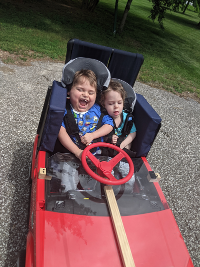
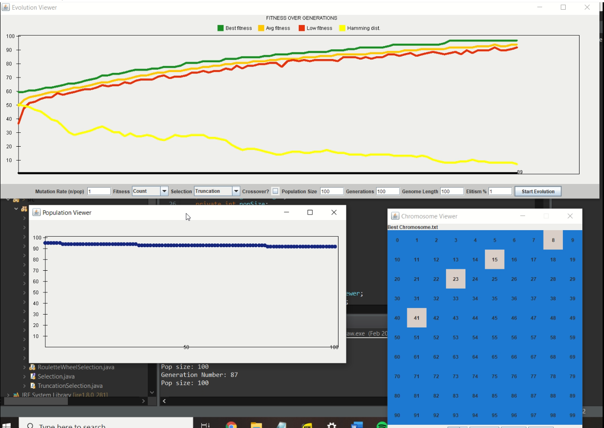

|--- [About me](./index.html)---      |---Projects---|    --- [Resume](./resume.html)---

# Projects

---

## Modified Power Wheels Car

Through the club on campus Make it Happen, I started working on a project for two kids with muscle distrophy. They loved riding around in power wheels cars, but their condition didn't allow them to do it safetly or comfortably. I worked with three other people on this project while getting input from the parents. 

This project went on way longer than we were hoping due to incompatible schedules, problems with online communication, and the general lack of experience and organization our team had. To get this project done and done well, we all had to step up even though we were busy. That included coming in during finals week to finish it before school ended. 

It was an interesting challenge to modify a car for specific needs. We ended up using a variety of techniques including 3D printing, sewing, woodworking, and "take it apart and hope for the best."

## Genetic Algorithm 

In the class Object Oriented Programming (CSSE220), our final project was (optionally) to do a research project using a genetic algorithm. Most other students opted to the arcade game project, but my partner and I wanted a challenge. The software we created simulates generations of a species throughout time. The genetic material from each generation can change based on the settings you give the program. The program records and displays the "fittest" individual's chromosome (simulated using 100 blocks of binary color). The graph shows how this fittness changes with each generation. The software includes a options for crossing over genetic material between individuals, changing the rate random changes or mutations between generations, keeping the fittest individual,  and sizes of the chromosome and population, and number of generations. 

## NASA CubeSat Feasibility Study

During my time at NASA, I worked on creating a 3D printed mock-up of a fuel cell. A Proton-Exchange Membrane Regenerative Fuel Cell has yet to be tested in Low-Earth Orbit (LEO), so my mentor wanted an analysis of the costs of launching a nano-satellite in the extra cargo space of a rocket. I worked with a partner on the 3D modeling and printing of the case, and I did research on the required electronics and created a high-level systems diagram. I learned a lot very quickly as satelitte technology is very specialized for the conditions of LEO. 

We presented to our findings to our mentors, but the project was put on the side-line with the increase in demand from the Artemis Program. 

## Bridestone Tire Analysis
ings and stuff and things 
